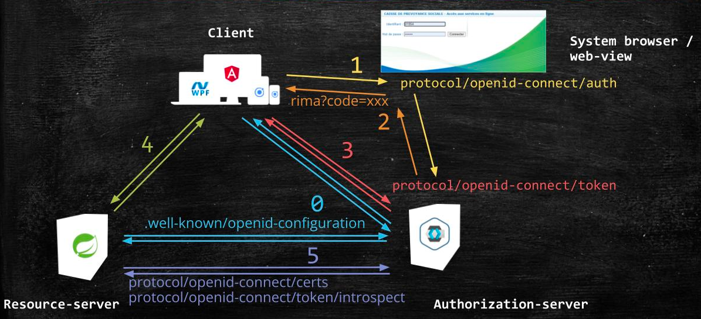

# Spring-Boot-Deep

## Environment
- jdk 17 LTS(long term support),spring-boot 3.x only support jdk 17 and later version
### Setting
- right click  File > Project Structure > Modules, & 
- set sources language level to 17
- set dependencies module sdk  to jdk 17

## Component
### spring-boot 3.x
> The tool was created by Pivotal Software and has been upgraded approximately every four years. The first version, Spring Boot 1.0, was released in 2014, Spring Boot 2.0 in 2018, and now Spring Boot 3.0 in November 2022.

[new features summary](https://www.rabitse.com/blog/introduction-to-spring-boot-3-what-are-the-most-significant-changes/):
- Java 17 Baseline with Java 19 Support
- Jakarta EE 9 e.g.[What is Jakarta](https://blog.payara.fish/jakarta-ee-java-ee-guide)
- GraalVM Native Image Support
- ...

### springdoc-openai v2.0.2
- springdoc-openapi v1.7.0 is the latest Open Source release supporting Spring Boot 2.x and 1.x.
- [OpenAPI 3 & Spring Boot](https://springdoc.org/#Introduction)

### springboot-oauth2.0

1. [OAuth2/OpenID for Spring Boot 3 API](https://dzone.com/articles/spring-oauth2-resource-servers)
2. 资源服务器可以使用公钥自动校验客户端请求的token（类似加签验签的过程），也可以通过调用授权服务服务器进行校验
3. 客户端利用秘钥secrets获取access_token应该是客户端后台去做，避免秘钥泄露
4. 分配的token应该包含发行者信息、资源主体、访问范围和失效时间